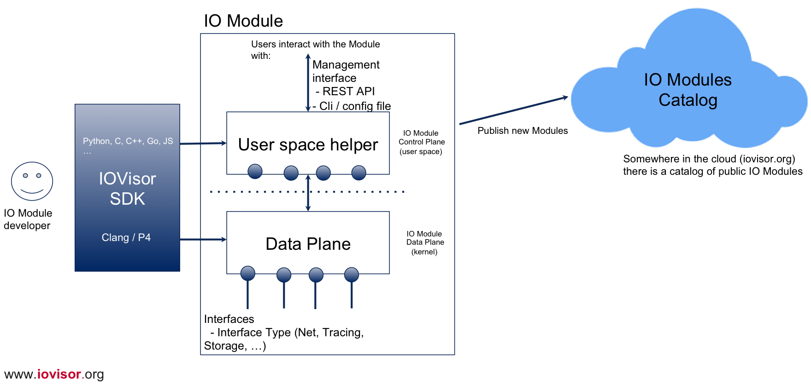

# IO modules
This repo contains the Hover Framework (IOModule manager) and plugins

# Hover Framework
Hover framework is a userspace deamon for managing IO Modules. It exposes REST front-end for dynamically loading, configuring, linking different modules to make a network topology.

# IO Modules Architecture


# Requirements
* google go version 1.4 or greater
* docker for some of the tests
* BCC

# Installing Hover
```bash
# prereqs
# make sure you have exported $GOPATH to your workspace directory.
go get github.com/vishvananda/netns
go get github.com/willf/bitset
go get github.com/gorilla/mux
# to pull customized fork of netlink
go get github.com/vishvananda/netlink
cd $GOPATH/src/github.com/vishvananda/netlink
git remote add drzaeus77 https://github.com/drzaeus77/netlink
git fetch drzaeus77
git reset --hard drzaeus77/master

go get github.com/iovisor/iomodules/hover
go install github.com/iovisor/iomodules/hover/hoverd
sudo -E go test -v github.com/iovisor/iomodules/hover/daemon

# run the hoverd binary in standalone mode
sudo $GOPATH/bin/hoverd
```
# Examples
# DnsMon IOModule
IO module that monitors and maintains statistics for IPv4/IPv6 DNS Queries
```bash
go get github.com/iovisor/iomodules/dnsmon
go install github.com/iovisor/iomodules/dnsmon/dnsmon
sudo $GOPATH/bin/dnsmon -hover http://127.0.0.1:5000
```
# Policy IOModule
IO module that implements group based policies for containers.
```bash
go get github.com/iovisor/iomodules/policy
$GOPATH/src/github.com/iovisor/iomodules/policy/test/test.sh


